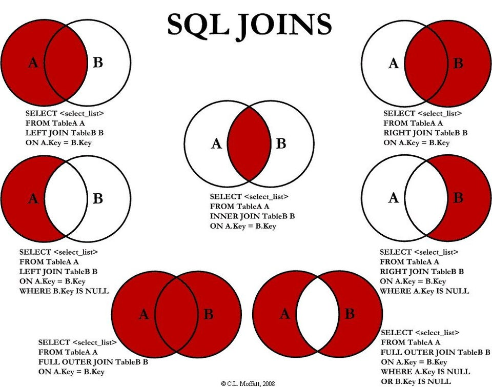
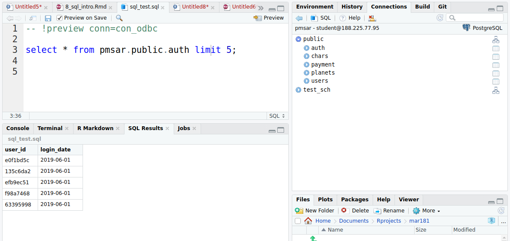

# SQL {-}

## Запись занятия {-}

<iframe width="560" height="315" src="https://www.youtube.com/embed/o44EYYJJN_A?si=X7JVJPX_aZNFfTKD" title="YouTube video player" frameborder="0" allow="accelerometer; autoplay; clipboard-write; encrypted-media; gyroscope; picture-in-picture; web-share" allowfullscreen></iframe>

<br>


```{r load-packages, include = FALSE}
pkgs <- c('data.table', 'RPostgreSQL')
for (pkg in pkgs) require(pkg, character.only = TRUE, quietly = TRUE, warn.conflicts = FALSE)

con <- dbConnect(PostgreSQL(max.con = 100),
                     user = "student",
                     password = "pmsar2018",
                     dbname = "pmsar",
                     host = "188.225.77.95",
                     port = 5432)
```

## DBeaver {-}

https://dbeaver.io/download/

<br>

## Параметры подключений {-}

user = "student"

password = "pmsar2018"

dbname = "pmsar"

host = "188.225.77.95"

port = 5432

<br>

## SQL {-}

### main structure {-}

SQL - декларативный язык с жестко закрепленным порядком операторов (зарезервированных ключевых слов) в sql-выражении. При запросе данных из таблицы обязательны `select` и `from`, остальные - по необходимости.

 - select (указание, какие колонки таблицы должны быть в результате, аналог j в data.table- dt[i, j, by])

 - from (из какой таблицы или результата слияния таблиц должны быть выбраны колонки)

 - join (какая таблица должна быть присоединена по ключу, аналог merge в R)

 - where (набор логических выражений для фильтрация по строкам, аналогично фильтрации в data.table в разделе i - dt[i, j, by])

 - group by (по значениям каких колонок должна быть группировка, аналог by в data.table - dt[i, j, by])

 - order by (по значениям каких колонок должна быть отсортированная результирующая таблица)

 - limit (ограничение на выдачу, сколько строк таблицы должно быть отдано)
 
 - ; (завершение запроса, некоторые IDE могут за пользователя подставлять)

<br>

### simple query {-}
Простейшие арифметические запросы требуют `select` и все:

```{sql connection=con}
select 1 + 5;
```

```{sql connection=con}
select now();
```

<br>

### select: columns selection {-}
Запросы для выбора колонок. `*` используется как аналог `select all`, то есть выбор всех колонок, которые есть в таблице. 

В разделе from указывается схема (набор таблиц) и таблица из этой схемы, через точку: `public.chars` означает `таблица chars из схемы public`:

```{sql connection=con}
select
  *
from public.chars
limit 3;
```

Также в блоке `select` можно указать одну или несколько колонок, результат арифметических операций над колонками.
```{sql connection=con}
select
  name,
  height,
  planet_name
from public.chars
limit 3;
```

Алиасы формы `column_name as new_name` используются для переименования колонок или результатов вычислений.
```{sql connection=con}
select 
  name as char_name,
  height,
  planet_name,
  height * 3 as height_mult
from public.chars
limit 3;
```

<br>

### where: rows selection {-}
Для фильтрации по строкам используют набор логических выражений в разделе `where`. `where planet_name = 'Coruscant'` читается как `все строки, в которых в колонке planet_name встречается значение Coruscant`. Строковые значения и даты указыаются в одинарных кавычках, двойные кавычки только для названий колонок и схем.

```{sql connection=con}
select 
  name,
  height,
  planet_name
from public.chars
where planet_name = 'Coruscant';
```

Логические выражения можно сочетать через операторы `and` и `or`, они аналогичны логическим операторам `&` и `|` в R.
```{sql connection=con}
select 
  name,
  height,
  planet_name
from public.chars
where 
  planet_name = 'Coruscant' 
  or height >= 170;
```

Оператор `in` аналогичен оператору `%in%` в R. Отрицание производится как `not in`:
```{sql connection=con}
select 
  name,
  height,
  planet_name
from public.chars
where 
  planet_name in ('Coruscant', 'Alderaan');
```

Также есть инструментарий проверки на вхождение, аналог `grepl()` в R. Для этого используется оператор `like`, а в качестве искомого выражения указывается строка, где `%` используются в качестве `любые символы`. Выражение `planet_name like '%Coru%'` можно прочитать как "все строки таблицы, в которых в колонке planet_name встречаются строковые значения, содержащие 'Coru', притом и до, и после 'Coru' могут быть еще символы"". Отрицание также делается как `not like`, для регулярных выражений используется оператор `~`:
```{sql connection=con}
select 
  name,
  height,
  planet_name
from public.chars
where 
  planet_name like '%Coru%'
  or planet_name ~ 'raan';
```

<br>

### group by: aggregations {-}
Группировки аналогичны группировкам в data.table - для каждой группы строк, выделяемых по значениям группирующей колонки, над колонками производятся вычисления (средние, суммы и проч). В примере ниже считается количество строк в таблице персонажей для каждого значения, количество уникальных персонажей (в таблице одна строка на персонажа, так что совпадает с предыдущим значением) и максимальный рост среди персонажей этой группы (всех персонажей с этой планеты):  

```{sql connection=con}
select 
  planet_name,
  count(*) as n_rows,
  count(distinct name) as n_unique_chars,
  max(height) as max_height
from public.chars
group by planet_name
limit 10;
```

<br>

### join {-}
Слияние таблиц по ключу, в R аналогом выступает `merge()`. В зависимости от схемы присоединения, используются разные операторы джойна, чайще сего - `left join` (сохраняем все значения ключевой колонки в той таблице, к которой присоединяем) и `inner join` (сохраняем только те строки, по которым значения есть и в той таблице, к которой присоединяем, и в которой присоединяем).

При этом в блоке `select` указываем те колонки, которые хотим получить из результата слияния. Если в таблицах используются одни и те же назания колонок, то колонки надо указывать с указанием таблицы или алиаса таблицы - `table1.column_name`. 

В разделе `from` указывается таблица, к которой присоединяется вторая или следующие таблицы.  По возможности это должна быть самая короткая таблица.

Ключ, по которому соединяются колонки - `using(column_name)`. В том случае, когда в разных таблицах колонка-ключ называется по-разному, можно использовать выражение `on table1.column_name1 = table2.column_name2`. Где `table1` и `table2` - назания таблиц и могут быть заменены алиасами таблиц. В редких случаях в конструкции с `on` можно использовать знаки сравнения, чтобы фильтровать определенные значения, 
это может ускорять выполнение запроса, но стилистически это лучше делать в разделе `where`.

Если через `join` присоединяется несколько таблиц, то они присоединяются не последовательно, к результату предыдущего джойна, а к таблице, указанной в `from` - то есть, порядок джойнов значения не имеет.

В том случае, если используется внутренний селект (в выражении join указывается не таблица, а подзапрос, с select, from и прочими атрибутами), то для таким образом полученной таблицы нужно указать алиас.
```{sql connection=con}
select 
  name,
  height,
  skin_color,
  climate,
  gravity,
  terrain,
  ch.url as char_url,
  pl.url as planet_url
from public.chars as ch
left join (
  select * 
  from public.planets
  limit 10) as pl using(planet_name)
order by name
limit 5;
```

Визуальная схема вариантов джойнов (для `merge()` тоже полезно, для понимания аргументов all.x, all.y)

 

<br>
<br>

## r connectors {-}
Для подключения из R используется пакет `RPostgreSQL`. С помощью функции `dbConnect()`, куда аоргументами передаются параметры подключения, создается объект-коннектор. 
```{r psql, eval = FALSE}
library(RPostgreSQL)
con <- dbConnect(PostgreSQL(max.con = 100),
                     user = "student",
                     password = "pmsar2018",
                     dbname = "pmsar",
                     host = "188.225.77.95",
                     port = 5432)
```

Запросы же делаются с помощью функции `dbGetQuery()` (простая функция для селектов, есть также отдельные функции для операций над таблицами). Первый аргумент функции - объект-коннектор, второй - строковая запись запроса. Нередко удобнее строку запроса записывать в отдельный объект: 

```{r psql2}
query <- "
  select
    name,
    height,
    planet_name
  from public.chars
  limit 3
"

res <- dbGetQuery(conn = con, statement = query)
res
```

Результат выполнения выражения - объект класса data.frame. То есть, его в дальнейшем желательно переконвертировать в data.table:
```{r}
class(res)
```

После завершения работы (в идеале-после каждого запроса) соединение с базой надо закрывать:
```{r}
dbDisconnect(con)
```

<br>

### Подключение и просмотр БД из RStudio {-}
В последних версиях RStudio реализовано подключение к базам данных, просмотр таблиц и вызов чистых sql-запросов - аналогично DBeaver. 

Для этого необходимо установить пакет `odbc` и соответствующие драйверы подключений баз данных (подробнее см. [здесь](https://db.rstudio.com/best-practices/drivers/)). Само создание подключения к PosgreSQL-базе данных выглядит аналогично подключению через пакет `RPostgreSQL`:
```{r, eval = FALSE}
con_odbc <- DBI::dbConnect(odbc::odbc(),
                           # sudo apt-get install odbc-postgresql
                           Driver   = "PostgreSQL Unicode",
                           Server   = "188.225.77.95",
                           Database = "pmsar",
                           UID      = "student",
                           PWD      = "pmsar2018",
                           Port     = 5432)
```

При этом в окне `Connections` (обычно в верхней правой части полей RStudio, где в `Environment` перечислены объекты в рабочем пространстве) появляются подключение и схемы базы данных, к которой совершено подключение. Схемы - раскрывающиеся списки, при клике выводятся все таблицы схемы.

После того, как в RStudio произведено подключение таким образом, можно писать запросы в отдельных скриптах - для этого необходимо создать скрипт с расширением `sql` (например, File > New file > SQL script), а в первой строчке указать подключение, и потом нажать Preview или Ctrl+Shift+Enter:

 

<br>
<br>

## Полезные ссылки {-}

Гайды хорошего оформления sql-кода. Им необязательно следовать дословно, но все же желательно принимать во внимание. ТАк или иначе, самое главное - код должен быть лаконичным, опрятным и читабельным для коллег.

- [style guide](https://github.com/mattm/sql-style-guide) - я предпочитаю такой гайд, хотя он во многом может вызывать нарекания. В частности, операторы многие пишут заглавными буквами, так как это повышает их видимость в коде. Также в этом гайде критикуется разное выравнивание ключевых слов и названий таблиц (чтобы формировался "коридор"). 

- второй [гайд](https://www.sqlstyle.guide/ru/), один из моих коллег старается ему следовать, например. Особенно осмысленно выглядит критика префиксов в названиях колонок.

- список [онлайн-курсов по SQL](https://www.datacamp.com/courses/tech:sql) на DataCamp. Курсов, может быть, больше чем надо для реальной работы, но пройти базовые вполне можно.

- русскоязычный [сайт-соревнование](http://sql-ex.ru/) по решению задачек на SQL, некоторые задачки могут быть достаточно хардкорны.

- еще один неплохой [ресурс](https://learndb.ru) с задачками по PostgreSQL. На самом деле онлайн-учебников и курсов очень много.

<br>

<!-- ## Домашнее задание -->

<!-- Повторить предыдущие задания по отрисовке графиков и вычислению метрик вовлечения и монетизации. Только вместо импорта и процессинга таблиц из файлов использовать sql-запросы. В идеале решение должно быть из создания подключения, sql-запроса и кода отрисовка графика, без дополнительных операций в R. -->
