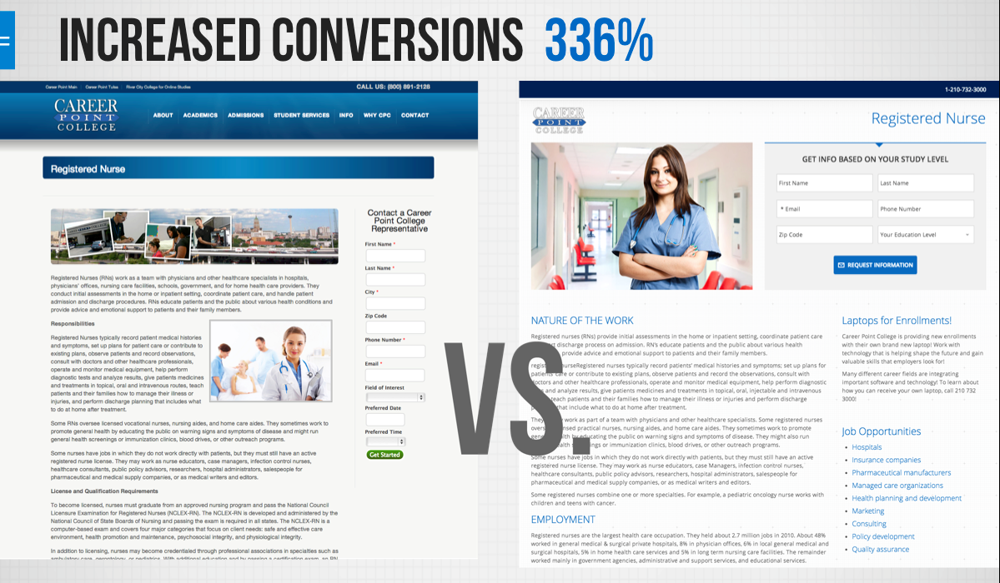
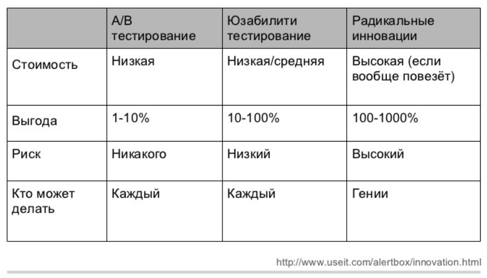
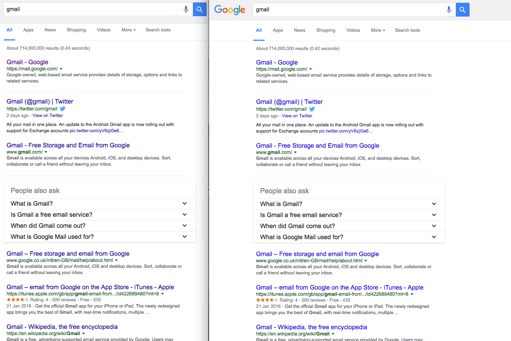

# A/b-тесты {-}

## Запись занятия {-}

<iframe width="560" height="315" src="https://www.youtube.com/embed/UN7dwaOlqW0?si=vNv0nrd72YqbcOCt" title="YouTube video player" frameborder="0" allow="accelerometer; autoplay; clipboard-write; encrypted-media; gyroscope; picture-in-picture; web-share" allowfullscreen></iframe>

## Принятие решений {-}

Экспертная оценка

Data-driven подход

Data-informed подход

## Проверка гипотез {-}

Гипотеза - предположение о причинах наблюдаемого поведения

Отличия от академических гипотез:

  - меньше требования к точности
  
  - больше опоры на согласованность с картиной мира
  
  - разные инструменты (не только статистика)

Аналитики регулярно сталкиваются с двумя большими классами ситуаций: 

- резкое изменение и выход значения метрики на новое плато

- медленное снижение метрики во времени

В таких ситуациях как раз и надо генерировать гипотезы о причинах наблюдаемой динамики. Типовые эвристики такие:

- ищем сегмент, на который пришлось самое большое снижение/изменение 

- в целом смотрим, как поменялась структура аудитории (и поменялась ли)

- проверяем возможный список причин (технические и продуктовые изменения), для ситуаций с резким выходом на новое плато значений

- ищем системные изменения в поведении (для медленных изменений метрик)

## Rice framework

### Охват (Reach)

Сколько пользователей затронут изменения за период?

### Влияние (Impact)
Компания Intercom разработала пятиуровневую систему оценки для оценки воздействия проекта:

- 3 = массивное воздействие,
- 2 = сильное воздействие,
- 1 = среднее воздействие,
- 0.5 = слабое воздействие,
- 0.25 = минимальное воздействие.

### Уверенность (Confidence)
Насколько вы уверены в своих оценках? :

100% = высокая уверенность
80% = средняя уверенность
50% = низкая уверенность
ниже 50% — тревожный сигнал

### Усилия (Effort)
Усилия, затрачиваемые всей командой на проект на всех стадиях.

## Что такое А/В-тесты {-}

### Определение  {-}

Аб-тесты пришли из экспериментальных наук, в частности, из медицины, психологии, даже сельского хозяйства. Основная идея - сравниваем разные варианты  - разные методы лечения, разные условия развития, в общем виде - разные методы воздействия.

**А/В-тесты (сплит-тесты)** - способ понять, станет ли продукт лучше, изменив часть продукта и сравнив с неизмененной частью

А - контрольная группа, группа без изменений
В - тестовая группа

 

### Области применения {-}

E-commerce / маркетинг - тестирование лендингов, иконок в сторе, рекламных креативов

UI - дизайн пользовательских интерфейсов, например, цвет или форма кнопок

Продукт - новые фичи, будь то предложения, схемы монетизации, новый контент или же просто функционал

Оффлайновые тесты - например, расстановка продуктов в магазинах

 

## A/B-тесты в жизни продукта {-}

**Cтартапам тесты не нужны**
Тесты - достаточно сложная парадигма, а стартапы в первую очередь ориентированы на реализацию идеи продукта, ключевые метрики. К тому же слишком много изменений - и на новых продуктах, и в каждом релизе у нас с десяток фичей, непонятно, как это тестировать. Или очень дорого. Да и в прод проще выкатить, так как на малом количестве пользователей можно позволить себе больше экспериментов

При этом можно тестировать самые базовые вещи на этапе концепта, в играх это сеттинг и визуальный стиль. Буквально парой фейковых страниц в сторе.

**А/В-тесты нужны для улучшения продукта**
Аналитика больше для зрелых компаний, которые задумываются о сокращении расходов, а также приходят к стадии улучшения качества фичей и дополнительного функционала. Полишинг и экономия. 

 

### А/В-тесты и другие инструменты

  
 

## Дизайн А/В-тестов {-}

### Общая структура {-}

- сформулировать и приоритезировать гипотезы

- выбрать метрику

- определить размер выборки

- разбить на группы

- показать пользователям

- проанализировать

- рассказать о результатах

 

### Cоставление и выбор гипотезы  {-}

**Какие гипотезы стоит проверять**
Высокая ценность и высокий риск. Тестируйте, тщательно исследуйте все детали.

Высокая ценность, уверенность и низкие риски. Запускайте в первую очередь.

Низкая ценность и низкие риски. Не тестируйте и, возможно, не запускайте вовсе.

Низкая ценность и высокие риски. Не стоит ваших усилий, в помойку.

 

### выбор метрики {-}

**Почему мы уверены, что эта фича окажет влияние?**
Нередко хотят тестировать какие-то минорные изменения, например, чуть скругленная иконка или чуть более яркие плашки в банке. Для компаний типа Гугла это нормально, но для нас бессмысленно - у нас есть более сильные факторы и гипотезы.

Общая идея - тестировать надо то, что хотя бы в теории может сильно повлиять на продукт. И проведение теста сильно меньше возможной прибыли. Новое предложение, новая схема монетизации и так далее. Если фича не может повлиять на продукт - то зачем она нужна? Также, если фича даже в теории не окажет негативного эффекта, то можно и так пушить. Впрочем, для компаний, которые борются за доли процента в метриках, это может быть иначе - там затраты меньше, чем возможная прибыль. 

**Как мы поймем, что фича оказала влияние?**
Очень большая проблема - нередко фичи делаются просто потому что делаются. Так было запланировано, так захотел продакт, начальник или кто-то еще. Важно понимать, как мы будем измерять эффект. Потому что если нет измерения - то смысл делать аб-тест? К тому же, понимание, на что влияет тестируемый фактор - это всегда понимание модели процесса, что должно измениться в первую очередь. 

Второе - понимание, какой будет эффект, нужно для расчеты выборки. Для слабых эффектов нужна большая выборка, а большая выборка может быть долго и дорого.

 

### разбиение на группы  {-}

**А/В, A/B/n-тесты**
Классический дизайн - есть контрольная группа, есть тестовая. Иногда тестовых групп может быть несколько. В редких случаях нет контрольной - когда мы выбираем что-то из альтернативы (лечение, схему монетизации и т.д.)

**АА/BB-тесты**
Специфичный вид. На мой взгляд, несколько устарелый - когда есть основания предполагать, что тестовая и контрольная группы неоднородны, их сплитят и сравнивают.

**ухудшающие А/В-тесты**
Нетривиальный дизайн, когда тестовая группа - это ухудшение продукта. Главное, создать разницу между группами.

**отрицательные А/В-тесты**
Редкий зверь. Вариация, когда выключается фича полностью (например, низкочастотная) и смотрим, как пользователи реагируют.

На группы разбивать можно по-разному - случайным образом 50/50, в некоторых случаях меньшие доли - 80/20, у меня был кейс 85/10/5, потому что на систему монетизации.

 

### размер аудитории {-}

**Какому количеству пользователей показывать?**
Всегда хочется сократить количество пользователей - их либо надо закупать (а это может быть дорого, например, 3-7 долларов), либо если они будут хуже платить, то страшно потерять деньги. Но при этом пользователей должно быть достаточно, чтобы проводить стат.анализ результатов. 

Все методы имеют ограничения, и в данном случае надо помнить, что чем слабее ожидаемый эффект, тем больше нужна выборка.

**Как долго вести тест?**
Это больше зависит от ситуации в продукте и ожиданиях топов. Вряд ли кто-то готов будет ждать несколько месяцев, пока наберется группа. С другой стороны, есть технические ограничения, например, нельзя за один день закупить пользователей.  Плюс есть всякие факторы сезонности, праздники и проч. Это уже в ошибках тестов.

 

### размер выборки {-}

ожидаемый эффект

доверительные интервалы

 

## Ошибки в А/В-тестах {-}

### Ошибка парадигмы {-}

**Вообще не проводить АВ-тесты**
Выкатить фичу на прод может быть в разы дороже, чем сделать аб-тест. Выкатить много фичей на прод одновременно - тем более, непонятно, что будет влиять. А аб-тесты структурируют план экспериментов

 

### Ошибки реализации {-}
**зафиксированные тестовые и контрольная группы**
В настоящее время редкая, но все же встречающаяся ошибка - когда пользователь навсегда попадает в какую-то группу. Вызвано, как правило, тем, что разработчики что-то не учли, а аналитики не проконтролировали. Вредно тем, что в какой-то момент пользователи тестовой и контрольной групп начинают сильно отличаться по опыту и, соответственно, могут по-разному реагировать на тесты.

**технические проблемы при разделении групп**
Как правило, когда пользователи попадают сразу в две группы, или метка не соответствует реальности. Такое может быть, особенно когда меняется система идентификации пользователя (истекают куки сайта). Есть и целенаправленные ситуации, когда производится подтасовка - [кейс RetailRocket и Rees](https://habr.com/en/company/retailrocket/blog/330012/), в котором уводились пользователи из сегмента.

**Ошибка в реализации тестируемых моделей**
Как-то мы тестировали простую схему - одним пользователям давали фиксированную скидку, другим - в зависимости от их платежной истории. Соответственно, сегменты вычислялись достаточно сложно. Важно было правильно определять сегмент и скидку для пользователя, перепроверяли работу серверников в холостых тестах.

Общий вывод - аналитики должны контролировать то, как технически реализованы тесты.

 

### Ошибки дизайна {-}
**игнорирование специфики метрики**
Надо учитывать, как ведет себя метрика, на изменение которой мы ориентируемся в тесте. Специфика метрики может накладывать свои результаты. Например, может быть недельное колебание удержания, и тогда тест надо проводить неделю, так как при коротких тестах на пару дней можно получить завышенные или заниженные результаты. Аналогично с активностью. Могут быть более длинные эффекты - например, начало учебного года или новогодние праздники.

**тестировать надо на той же выборке, на которой будем применять**
Тестировать платежку на жителях Филиппин можно, но странно. Но делают. Аналогично - тестировать на доп.офисах в спальных районах и в центрах города (или в провинции и в москве) - странная идея.

**должны быть исключены внешние факторы (вести группы параллельно)**
Последовательные группы (две рекламные кампании) или две версии - это не аб-тест. Потому что есть куча побочных факторов, которые сложно проконтролировать.

**тестируется сразу несколько изменений**
Частая ошибка, когда на одной и той же выборке тестируется два или больше вариантов. Проблема в том, что в результате получается не 2 группы, а 4, а выборка уменьшается.

**предложения в тестовой и контрольной группе неоднородны**
Иногда бывает так, что само предложение в тестовой группе влияет на целевую метрику. Например, когда мы предлагаем два пакета за одну цену, но в одном скидка чуть больше.

**перебор вариантов руками пользователей (рост ошибки I рода)**
Кейса гугла. 41 вариант цвета ссылки. Общая логика проверки гипотез - у нас есть до 5% вероятности, что группы все-таки не различаются, случайно нашли то, чего нет.  Вообще, это именно ошибка дизайна - группы должны формироваться из какой-то конкретной гипотезы, а не просто искать хороший вариант.

 

### Ошибки в анализе {-}
**подсматривание результатов в процессе**
Всем хочется побыстрее узнать результаты, поэтому смотрят постоянно на группы. Это ошибка, потому что всегда есть вариативность и даже неразличимые группы в некоторые моменты могут различаться. Притом, чем чаще подсматриваешь, тем выше вероятность сделать ложный вывод.
Притом, подсматривать можно, но выводы делать только после набора выборки.

Варианты решения - использование неклассических стат.парадигм, в частности, последовательного семплинга.

**игнорируется форма распределения**
Чисто техническая проблема, когда применяются некорректные методы проверки стат.гипотез

**игнорируется размер эффекта**
Важно вообще понимать, какой рычаг у теста.

 

### Ошибки в интерпретации {-}
**не учитываются долгосрочные эффекты**
Часто вывод по аб-тестам делается в достаточно быстро после окончания теста. При этом игнорируются какие-то долгосрочные эффекты. Например, если пользователь сейчас купил товар по высокой скидке (в тестовой группе больше продаж и прибыль), надо посмотреть, а как он дальше будет покупать. В играх это проблема с банком и ростом прогрессии - в начале игры маленьких платежей достаточно для победы, на дальних этапах уже нет. При тестировании на Филиппинах можно сильно ошибиться.

**не учитываются косвенные эффекты (как в целом реагирует система)**
Может быть каннибализация - когда эффект от тестовой фичи съедает эффекты от других фич. Пользователь купил по скидке, и не стал покупать другие предложения. Тестовая группа выиграла, но в тестовой группе совокупно просели платежи. Может быть и обратная сторона - в тестовой группе платежи просесть могли по другой причине, не в тестовой фиче.

**слабые или отсутствующие эффекты интрепретируются как тенденции**
Зона “когда очень хочется” - статистически есть достаточно строгие правила принятия решений, при этом даже при отсутствующих различиях хочется интерпертировать некоторые показатели. Иногда просто показаны средние, но не показаны дисперсии (а если выборка маленькая, то штормить может сильно).

**отсутствие положительных различий воспринимается как неудача**
Все как в науке, если гипотеза не подтвердилась, то ты неудачник. Хотя аб-тесты, да и наука, в общем-то, не так работают. Отсутствие различий - тоже результат. Но да, он может быть болезнен для продакта. 

Иногда высказываются предположения, почему тест не сработал. Важно понимать, что это тоже гипотезы, и их тоже тестировать надо. И если бы эта гипотеза была правдоподобной, мы бы ее тестировали в первом тесте, додумались бы заранее.

**уверенность, что тест сломан, недостаточно долго идет и т.д.**
Когда тест не подтверждает гипотезу, в которую веришь - грустно и хочется продлить тест, как-нибудь отфильтровать выборку и так далее. Мой кейс с сегментированием пользователей по платежной истории - сложная система оказалась сравнима с нарисованной на коленке.

**неудачные эксперименты скрываются или подделываются**
Все как в науке - перекос в сторону открытий и новизны. В критических случаях результаты переинтрпретируются или даже подделываются.

 

## Pro et contra {-}

### contra {-}
**надо что-то менять**
Внедрение аб-тестов требует достаточно много времени и сил на разработку. Во-первых, сбор данных и разделения выборки на группы (кейс OK и Димы Бугайченко). Во-вторых, сами группы (системы ранжирования, выдачи, рекомендаций). 

**требуют квалифицированных сотрудников**
АБ-тесты активно используют аппарат математической статистики, поэтому нужны люди, которые это умеют делать. В идеале, чтобы еще был опыт взаимодействия с продуктом, доменной областью. Этих людей надо искать или растить.

**не подтверждают гипотезы**
Далеко не все гипотезы подтверждаются, и это вызывает боль, спекуляции и постоянные сомнения - а вдруг что-то неправильно сделали в тесте, а гипотеза верная.

 

### pro {-}

**мировой тренд на data-driven подход**
Общий тренд в мире в принятии решений - рациональное обоснование и попытка избежать когнитивных искажений, вызванных субъективным опытом. В этом смысле тут лидирует проверка гипотез на данных. Не чистый data-driven, но каждое решение проверяется на данных или согласовывается с данными. 

**снижает вероятность неправильных решений и экономит деньги**
Разработка новой фичи может быть дорогая, эффект фичи может быть негативный и вести к убыткам. Но всегда будет сопротивление “это не фича плохая”, это сезон/праздники/трафик etc - то, что нельзя опровергнуть. Во-вторых, в тесте могут вскрыться доп.эффекты. Кейс Гарфилда из ГИ.

**уменьшает страх ошибки у рядовых сотрудников**
Когда есть система с понятной логикой принятия решения, человек, который выкатывает фичу, вынужден думать о том, что делать, если фича не работает. В идеале автоматическое тестирование и тестирование множества разных гипотез (аджайл-парадигма).

**автоматизация проверки многих гипотез**
В какой-то момент компании, которые динамично развиваются и широко работают с данными, приходят к идее систем автоматических тестов - в ОК такая система интегрирована в джиру, и тот, кто задает эксперимент, просто указывает когорты и группу метрик, а результаты сыпятся в комментарии. У нас тоже есть система аб-тестов, не настолько сильная, но и делаем мы ее недолго.

 

## Полезные материалы {-}

Очень хороший [канал](https://t.me/abtesting) про A/B-тесты в телеграме

[дайджест](https://www.facebook.com/groups/173955382668026?view=permalink&id=684532274943665) всяких материалов, собирает Юрий Ветров (долгое время главный по дизайну в mail.ru)

отличный [материал](https://gopractice.ru/how-not-to-analyze-abtests/) от Олега Якубенкова, один из лучших по этой теме подглядываний в аб-тестах. Плюс есть набор ссылок.

А/Б тестирование: от А до Б (неплохой [набор](https://medium.com/@borodish/%D0%B0-%D0%B1-%D1%82%D0%B5%D1%81%D1%82%D0%B8%D1%80%D0%BE%D0%B2%D0%B0%D0%BD%D0%B8%D0%B5-%D0%BE%D1%82-%D0%B0-%D0%B4%D0%BE-%D0%B1-8c7278f824b1) ссылок)

Ваши A/B-тесты сломаны (подробный [разбор](https://habr.com/en/company/jugru/blog/358104/) некоторых ошибок в тестах, хотя местами очень уж самовлюбленное выступление)

Пара [слов](https://measuringu.com/effect-sizes/?fbclid=IwAR1EZGQvlDbBpaYowsewgpZgDgs2eyk50nSOrPqJB0Rf7VbmupMMrpEsaxY) про выборку и размер эффекта.

Немного спорное [мнение](https://medium.com/no-flame-no-game/%D0%BD%D0%B5%D1%81%D0%BA%D0%BE%D0%BB%D1%8C%D0%BA%D0%BE-%D0%B7%D0%B0%D0%B4%D0%B0%D1%87%D0%B5%D0%BA-%D0%BF%D1%80%D0%BE-a-b-%D1%82%D0%B5%D1%81%D1%82%D1%8B-f7b6c4c25db2) про интерпретацию аб-тестов.

Неплохой [доклад](https://www.youtube.com/watch?v=SZKEHIuhSdY) Вита Черемисинова на конфе игроделов. 

Отличный [плейлист](https://www.youtube.com/playlist?list=PLVig2Nz9tH0g_1xHtbWf3T4ReIxByjSDN) по А/В-тестам от весьма известных в сообществе ребят.

